# ft_transcendence

> A full-stack multiplayer gaming and chat platform built with TypeScript, Fastify, Next.js, and Docker.

---

## Dashboard Screens

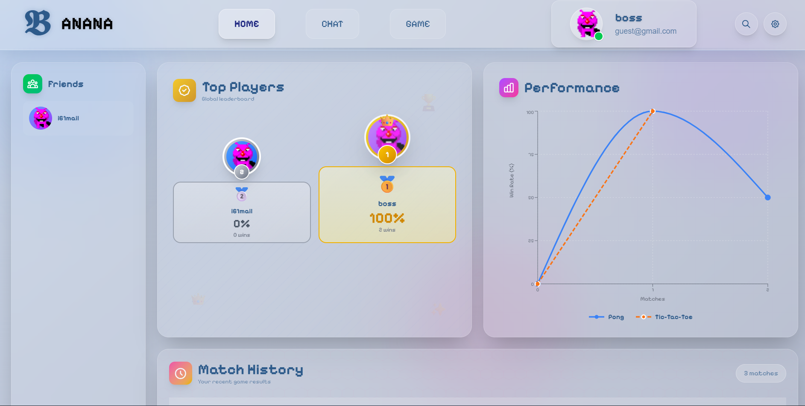
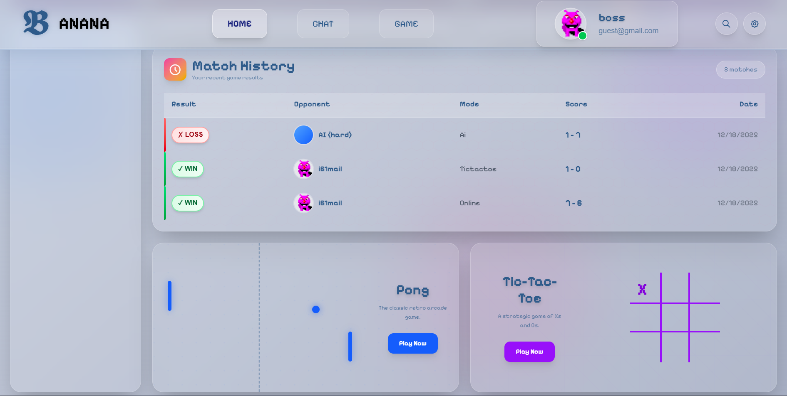


---

## Overview

**ft_transcendence** is a real-time web application where users can:
- Register/login (with OAuth and 2FA support)
- Manage profiles and avatars
- Chat (1:1)
- Add/block friends
- Play Pong and Tic-Tac-Toe (local, AI, tournaments and online)
- Join tournaments and send/accept invites
- View leaderboards and match history

The app is containerized and includes monitoring with Prometheus and Grafana.

---

## Login & Register Screens

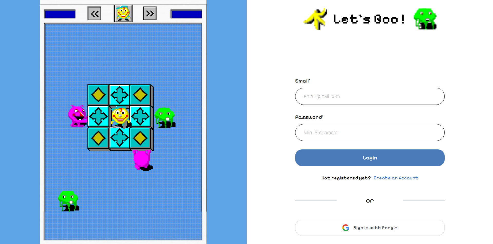
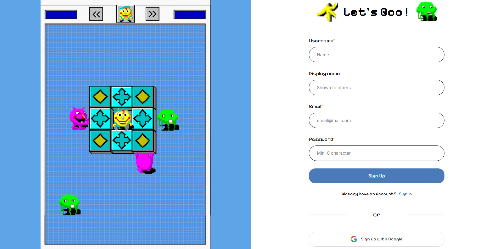
 
---

## Technologies Used

### Backend (`back/`)
- Node.js + TypeScript
- Fastify (API, WebSocket)
- SQLite (via better-sqlite3)
- JWT (authentication)
- OAuth2 (Google)
- Prometheus client (metrics)

### Frontend (`front/`)
- Next.js (React, App Router)
- TypeScript
- Tailwind CSS
- Zustand (state management)
- WebSocket (real-time)

### DevOps & Monitoring
- Docker & Docker Compose
- Nginx (reverse proxy)
- Prometheus (metrics)
- Grafana (dashboards)

---

## Application Structure & Flow

---
## Chat Screen

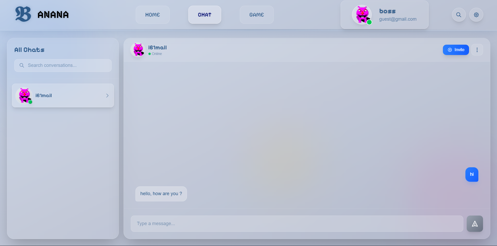

---

## profile Screen

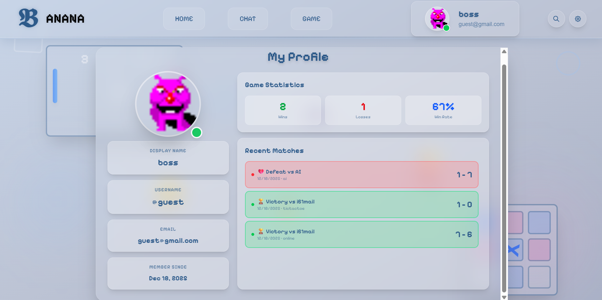

---

## two games

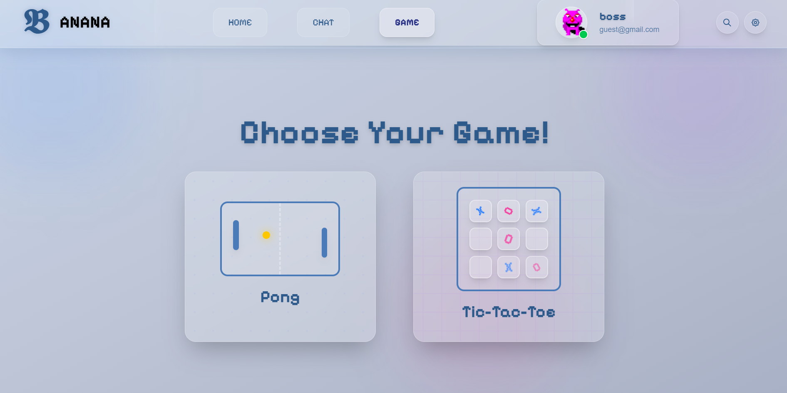

---

## pong modes

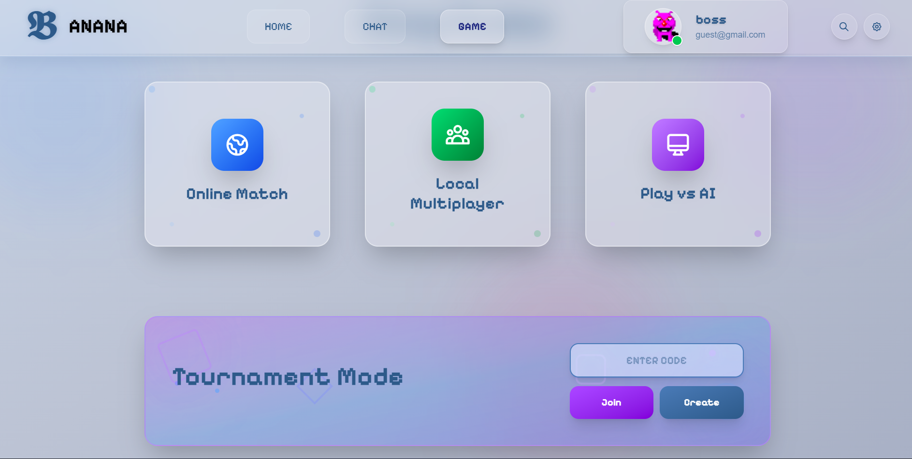

---

## ttt modes

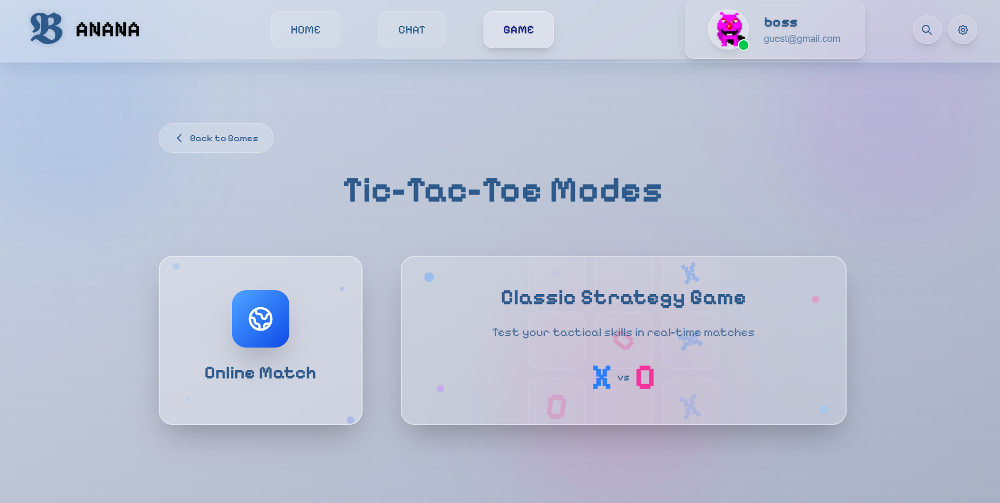

---

## tournament

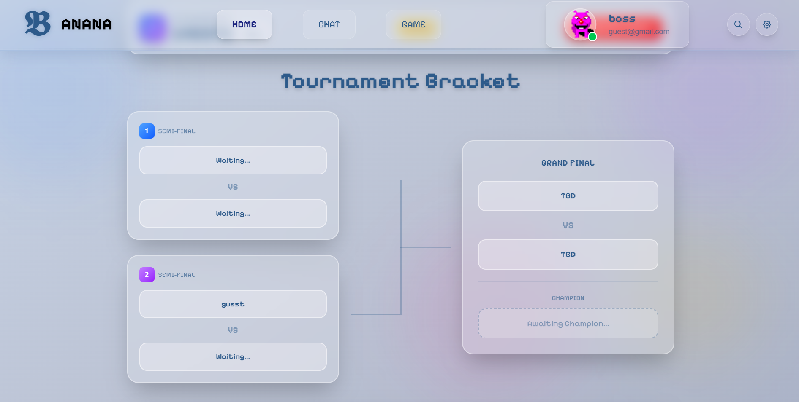

---

## edit info

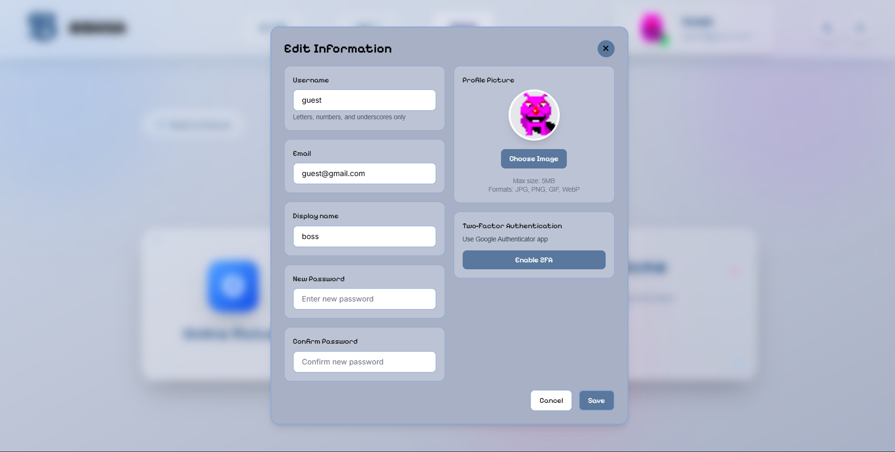

---

### Backend
- **API**: Fastify serves endpoints for auth, profile, chat, friendship, block, invite, games, and metrics.
- **WebSocket**: Real-time chat, notifications, and games (Pong, Tic-Tac-Toe, tournaments).
- **Database**: SQLite stores users, friendships, messages, matches, blocks, etc.
- **Auth**: JWT-based, with optional Google OAuth and 2FA (TOTP).
- **Metrics**: Prometheus metrics exposed at `/metrics`.

### Frontend
- **Next.js**: App router, client/server components, Tailwind styling.
- **Pages**: Auth, dashboard, profile, chat, games, tournaments, etc.
- **State**: Zustand store for user, chat, and game state.
- **WebSocket**: For chat, notifications, and live games.
- **Components**: Modular, including chat, game canvas, avatar upload, etc.

### DevOps
- **Docker Compose**: Orchestrates backend, frontend, nginx, prometheus, grafana, etc.
- **Makefile**: Simple commands for build/start/stop/cleanup.

---

## How to Run

### Prerequisites
- Docker & Docker Compose

### 1. Clone the Repository
```sh
git clone <repo-url>
cd ft_transcendence
```

### 2. Configure Environment Variables
- Copy or edit the `.env` file in the root and set required values (see `.env.example`).

### 3. Build and Start All Services
```sh
sudo make
```
- This builds and starts all containers (backend, frontend, nginx, monitoring).

### 4. Access the Application
- **Frontend**: https://localhost:8080
- **Backend API**: https://localhost:4000
- **Grafana**: http://localhost:3001 (default login: superUser/superPass)

#### Grafana Login Screen
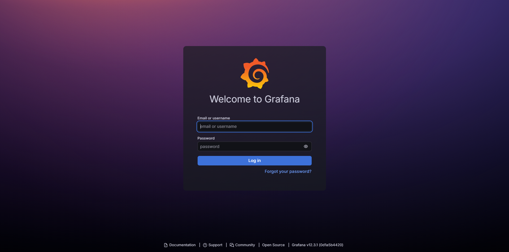

#### Example Grafana Dashboards
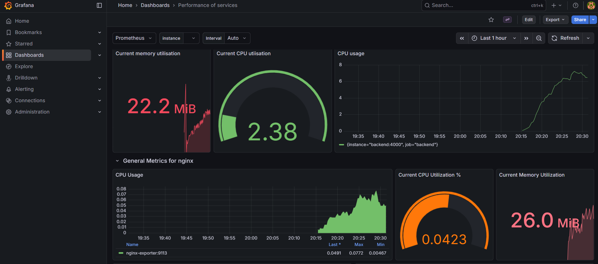


### 5. Stopping the Application
```sh
sudo make stop
```

### 6. Remove Containers and Clean Up
```sh
sudo make remove
sudo make cleanup # (removes all containers/images)
```

---

## Development

- You can run backend and frontend separately for development:
  - `cd back && npm install && npm run dev`
  - `cd front && npm install && npm run dev`
- Update ports and environment variables as needed.

---

## Contributing

Feel free to open issues or submit pull requests for improvements!

---


